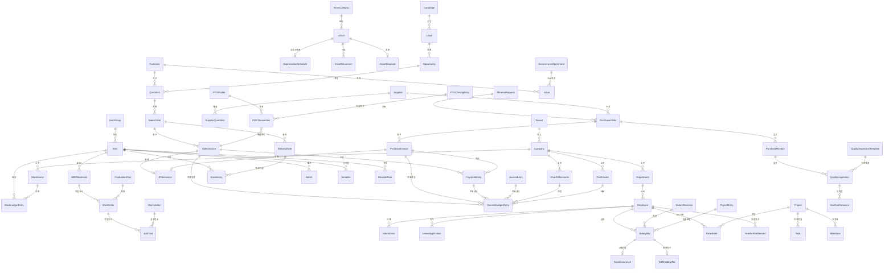

# 도메인 핵심 엔티티

> `docs/product/scope/01-module-catalog.csv` 기반으로 도출한 모듈별 핵심 엔티티 정의.
> NoSQL(FerretDB) 컬렉션 설계 원칙에 따라 문서 지향 구조로 설계한다.

---

## 설계 원칙

| 원칙 | 설명 |
|------|------|
| **컬렉션별 완전 분리** | 엔티티 1개 = 컬렉션 1개. 조인 없음 |
| **격리 최우선** | `tenant_id`를 모든 컬렉션의 첫 번째 인덱스 필드로 설정 |
| **비정규화** | 자주 조회되는 참조 데이터를 임베딩 (예: 품목명, 고객명) |
| **문서 기반 설계** | 트랜잭션 문서(SO, PO 등)는 라인 아이템을 서브다큐먼트 배열로 포함 |
| **테넌트 스코프** | 모든 엔티티에 `tenant_id` 필드 필수. 쿼리 시 항상 `tenant_id` 조건 포함 |

---

## 공통 필드 (모든 컬렉션)

| 필드 | 타입 | 설명 |
|------|------|------|
| `_id` | string | 넘버링 규칙 기반 식별자 (예: `SO-2026-00001`) |
| `tenant_id` | string | 테넌트 식별자 (첫 번째 인덱스) |
| `docstatus` | int | 문서 상태 (0=초안, 1=제출, 2=취소) |
| `created_at` | datetime | 생성 일시 |
| `updated_at` | datetime | 수정 일시 |
| `created_by` | string | 생성자 사용자 ID |
| `updated_by` | string | 수정자 사용자 ID |

---

## 모듈별 핵심 엔티티

### 1. Accounting (회계)

| 엔티티 | 설명 | 주요 필드 |
|--------|------|-----------|
| **ChartOfAccounts** | 계정과목 | `account_name`, `account_type`(자산/부채/수익/비용/자본), `parent_account`, `is_group`, `currency` |
| **JournalEntry** | 분개 전표 | `posting_date`, `voucher_type`, `total_debit`, `total_credit`, `items[]`(서브다큐먼트: account, debit, credit, cost_center) |
| **GeneralLedgerEntry** | 총계정원장 | `posting_date`, `account`, `debit`, `credit`, `voucher_type`, `voucher_no`, `cost_center`, `balance` |
| **CostCenter** | 원가센터 | `cost_center_name`, `parent_cost_center`, `is_group`, `company` |
| **Budget** | 예산 | `fiscal_year`, `cost_center`, `budget_items[]`(account, monthly_amounts[]) |
| **AccountingPeriod** | 회계기간 | `period_name`, `start_date`, `end_date`, `status`(open/closed), `company` |
| **ETaxInvoice** | 전자세금계산서 | `invoice_ref`, `issue_date`, `supplier_or_customer`, `supply_amount`, `tax_amount`, `nts_confirmation_no`, `transmission_status` |
| **CurrencyExchange** | 환율 | `from_currency`, `to_currency`, `exchange_rate`, `date` |

### 2. Selling (판매)

| 엔티티 | 설명 | 주요 필드 |
|--------|------|-----------|
| **Quotation** | 견적서 | `customer`(임베딩: id, name), `transaction_date`, `valid_till`, `items[]`(item_code, item_name, qty, rate, amount), `total`, `grand_total` |
| **SalesOrder** | 판매주문 | `customer`, `delivery_date`, `items[]`(item_code, item_name, qty, rate, amount, delivered_qty), `total`, `grand_total`, `payment_terms` |
| **DeliveryNote** | 출하(납품) | `customer`, `posting_date`, `sales_order_ref`, `items[]`(item_code, qty, warehouse, batch_no, serial_nos[]), `transporter` |
| **SalesInvoice** | 매출세금계산서 | `customer`, `posting_date`, `due_date`, `items[]`(item_code, qty, rate, amount), `taxes[]`, `grand_total`, `outstanding_amount`, `etax_invoice_ref` |
| **PriceList** | 가격표 | `price_list_name`, `currency`, `selling`(bool), `prices[]`(item_code, rate, min_qty) |
| **SalesPartner** | 판매파트너 | `partner_name`, `commission_rate`, `territory` |

### 3. Buying (구매)

| 엔티티 | 설명 | 주요 필드 |
|--------|------|-----------|
| **Supplier** | 공급업체 | `supplier_name`, `supplier_type`, `tax_id`, `default_currency`, `payment_terms`, `address`, `contact` |
| **MaterialRequest** | 구매요청 | `requester`, `department`, `required_date`, `items[]`(item_code, item_name, qty, warehouse), `purpose`(구매/이동/제조) |
| **PurchaseOrder** | 구매주문 | `supplier`(임베딩: id, name), `transaction_date`, `items[]`(item_code, qty, rate, amount, received_qty), `total`, `grand_total` |
| **PurchaseReceipt** | 입고 | `supplier`, `posting_date`, `purchase_order_ref`, `items[]`(item_code, qty, warehouse, batch_no, rejected_qty), `quality_inspection_ref` |
| **PurchaseInvoice** | 매입세금계산서 | `supplier`, `posting_date`, `due_date`, `items[]`(item_code, qty, rate, amount), `taxes[]`, `grand_total`, `outstanding_amount`, `etax_invoice_ref` |
| **SupplierQuotation** | 공급업체 견적 | `supplier`, `transaction_date`, `items[]`(item_code, qty, rate), `valid_till` |

### 4. Stock (재고)

| 엔티티 | 설명 | 주요 필드 |
|--------|------|-----------|
| **Item** | 품목 | `item_code`, `item_name`, `item_group`, `stock_uom`, `is_stock_item`, `has_batch_no`, `has_serial_no`, `valuation_method`, `default_warehouse` |
| **ItemGroup** | 품목 그룹 | `group_name`, `parent_group`, `is_group` |
| **Warehouse** | 창고 | `warehouse_name`, `parent_warehouse`, `is_group`, `company`, `address` |
| **StockEntry** | 재고이동 | `stock_entry_type`(입고/출고/이동/제조입고/폐기), `posting_date`, `items[]`(item_code, qty, source_warehouse, target_warehouse, batch_no, serial_nos[], valuation_rate) |
| **StockLedgerEntry** | 재고 원장 | `item_code`, `warehouse`, `posting_date`, `qty_change`, `valuation_rate`, `balance_qty`, `balance_value`, `voucher_type`, `voucher_no` |
| **Batch** | 로트(배치) | `batch_id`, `item_code`, `manufacturing_date`, `expiry_date`, `supplier_ref` |
| **SerialNo** | 시리얼번호 | `serial_no`, `item_code`, `status`(active/delivered/returned/scrapped), `warehouse`, `purchase_ref`, `delivery_ref` |
| **StockReconciliation** | 재고실사 | `posting_date`, `items[]`(item_code, warehouse, current_qty, actual_qty, valuation_rate) |
| **ReorderRule** | 리오더 규칙 | `item_code`, `warehouse`, `reorder_level`, `reorder_qty`, `lead_time_days` |

### 5. Manufacturing (생산)

| 엔티티 | 설명 | 주요 필드 |
|--------|------|-----------|
| **BillOfMaterials** | BOM | `item_code`(완제품), `quantity`, `items[]`(item_code, qty, rate), `operations[]`(operation, workstation, time_in_mins), `total_cost` |
| **WorkOrder** | 작업지시 | `production_item`, `bom_ref`, `qty`, `produced_qty`, `start_date`, `expected_delivery`, `status`, `items[]`(required materials) |
| **ProductionPlan** | 생산계획 | `plan_date`, `items[]`(item_code, planned_qty, bom_ref, sales_order_ref), `material_requests[]` |
| **Workstation** | 작업장(공정) | `workstation_name`, `production_capacity`, `hour_rate`, `working_hours` |
| **JobCard** | 작업카드 | `work_order_ref`, `operation`, `workstation`, `employee`, `started_time`, `completed_time`, `total_time`, `qty_completed` |
| **Operation** | 작업 공정 | `operation_name`, `description`, `default_workstation` |

### 6. Projects (프로젝트)

| 엔티티 | 설명 | 주요 필드 |
|--------|------|-----------|
| **Project** | 프로젝트 | `project_name`, `status`, `start_date`, `end_date`, `estimated_cost`, `actual_cost`, `percent_complete`, `company`, `customer` |
| **Task** | 작업 | `project_ref`, `subject`, `status`, `priority`, `assigned_to`, `start_date`, `end_date`, `expected_time`, `actual_time` |
| **Timesheet** | 타임시트 | `employee`, `time_logs[]`(project, task, activity_type, from_time, to_time, hours, billing_rate, billing_amount) |
| **Milestone** | 마일스톤 | `project_ref`, `title`, `milestone_date`, `is_completed` |
| **ActivityType** | 활동 유형 | `activity_type`, `billing_rate`, `costing_rate` |

### 7. CRM

| 엔티티 | 설명 | 주요 필드 |
|--------|------|-----------|
| **Customer** | 고객 | `customer_name`, `customer_type`(개인/법인), `customer_group`, `territory`, `tax_id`, `default_currency`, `address`, `contact` |
| **Lead** | 리드 | `lead_name`, `company_name`, `source`, `status`, `email`, `phone`, `territory`, `campaign_ref` |
| **Opportunity** | 영업기회 | `opportunity_from`(lead/customer), `opportunity_type`, `status`, `expected_closing`, `probability`, `opportunity_amount`, `sales_stage` |
| **Activity** | 활동 기록 | `reference_type`, `reference_id`, `activity_type`(전화/이메일/미팅), `date`, `summary`, `assigned_to` |
| **Campaign** | 캠페인 | `campaign_name`, `start_date`, `end_date`, `budget`, `status` |

### 8. HR (인사)

| 엔티티 | 설명 | 주요 필드 |
|--------|------|-----------|
| **Employee** | 직원 | `employee_name`, `department`, `designation`, `employment_type`, `date_of_joining`, `date_of_birth`, `gender`, `status`(active/left/suspended), `reports_to`, `company` |
| **Department** | 부서 | `department_name`, `parent_department`, `company`, `is_group` |
| **Designation** | 직급 | `designation_name`, `description` |
| **Attendance** | 근태 | `employee`, `attendance_date`, `status`(출근/결근/반차/휴가), `check_in`, `check_out`, `working_hours` |
| **LeaveType** | 휴가 유형 | `leave_type_name`, `max_leaves_allowed`, `is_carry_forward`, `is_paid_leave` |
| **LeaveApplication** | 휴가 신청 | `employee`, `leave_type`, `from_date`, `to_date`, `total_leave_days`, `status`(draft/submitted/approved/rejected), `leave_approver` |
| **EmployeeTransfer** | 인사발령 | `employee`, `transfer_date`, `transfer_details[]`(property, old_value, new_value) |

### 9. Payroll (급여)

| 엔티티 | 설명 | 주요 필드 |
|--------|------|-----------|
| **SalaryStructure** | 급여체계 | `structure_name`, `company`, `is_active`, `earnings[]`(component, formula, amount), `deductions[]`(component, formula, amount) |
| **SalaryComponent** | 급여 구성요소 | `component_name`, `type`(수당/공제), `is_tax_applicable`, `depends_on_payment_days` |
| **SalarySlip** | 급여 슬립 | `employee`, `salary_structure_ref`, `posting_date`, `start_date`, `end_date`, `earnings[]`, `deductions[]`, `gross_pay`, `net_pay`, `total_deduction` |
| **PayrollEntry** | 급여 일괄처리 | `payroll_date`, `company`, `department`, `salary_slips[]`, `total_amount`, `payment_account` |
| **SocialInsurance** | 4대보험 | `employee`, `period`, `national_pension`(국민연금), `health_insurance`(건강보험), `long_term_care`(장기요양), `employment_insurance`(고용보험), `industrial_accident`(산재보험), `employer_share`, `employee_share` |
| **WithholdingTax** | 원천징수 | `employee`, `period`, `income_tax`(소득세), `local_income_tax`(지방소득세), `taxable_income`, `tax_base` |
| **YearEndSettlement** | 연말정산 | `employee`, `fiscal_year`, `total_income`, `deductions`(인적공제/보험료/의료비/교육비/기부금 등), `tax_credits[]`, `calculated_tax`, `already_paid_tax`, `refund_or_additional` |

### 10. Support (고객지원)

| 엔티티 | 설명 | 주요 필드 |
|--------|------|-----------|
| **Issue** | 문의(티켓) | `subject`, `customer`, `issue_type`, `priority`, `status`(open/replied/resolved/closed), `assigned_to`, `sla_ref`, `first_response_time`, `resolution_time` |
| **IssueType** | 이슈 유형 | `type_name`, `description` |
| **ServiceLevelAgreement** | SLA 정책 | `sla_name`, `default_priority`, `response_time`(분), `resolution_time`(분), `support_days[]` |
| **KnowledgeBase** | 지식베이스 | `title`, `content`, `category`, `status`(draft/published/archived), `views`, `helpful_count` |

### 11. Assets (자산)

| 엔티티 | 설명 | 주요 필드 |
|--------|------|-----------|
| **Asset** | 자산 | `asset_name`, `asset_category`, `item_code`, `purchase_date`, `gross_purchase_amount`, `current_value`, `depreciation_method`, `useful_life_months`, `status`(draft/submitted/in_use/scrapped/sold), `location`, `custodian` |
| **AssetCategory** | 자산 카테고리 | `category_name`, `depreciation_method`(정액법/정률법/생산량비례법), `useful_life_months`, `finance_book` |
| **DepreciationSchedule** | 감가상각 스케줄 | `asset_ref`, `schedules[]`(date, depreciation_amount, accumulated_amount, book_value) |
| **AssetMovement** | 자산이동 | `asset_ref`, `movement_date`, `from_location`, `to_location`, `from_custodian`, `to_custodian` |
| **AssetDisposal** | 자산처분 | `asset_ref`, `disposal_date`, `disposal_type`(매각/폐기), `sale_amount`, `book_value`, `gain_or_loss` |

### 12. Setup/Admin (설정)

| 엔티티 | 설명 | 주요 필드 |
|--------|------|-----------|
| **Company** | 회사 | `company_name`, `abbr`, `default_currency`, `country`, `tax_id`, `fiscal_year_start` |
| **Tenant** | 테넌트 | `tenant_name`, `status`(active/suspended/terminated), `companies[]`, `plan`, `created_at` |
| **User** | 사용자 | `email`, `full_name`, `roles[]`, `enabled`, `last_login`, `oidc_sub` |
| **Role** | 역할 | `role_name`, `description`, `is_custom` |
| **RolePermission** | 역할 권한 | `role`, `doctype`, `read`, `write`, `create`, `delete`, `submit`, `cancel`, `amend` |
| **WorkflowDefinition** | 워크플로우 | `document_type`, `states[]`(state, allowed_roles, next_actions[]), `transitions[]`(from, to, action, allowed_roles) |
| **NamingSeries** | 넘버링 규칙 | `doctype`, `prefix`, `current_value`, `format_pattern` |
| **NotificationRule** | 알림 규칙 | `document_type`, `event`(생성/수정/제출 등), `recipients[]`, `channel`(email/web), `message_template` |

### 13. Quality (품질)

| 엔티티 | 설명 | 주요 필드 |
|--------|------|-----------|
| **QualityInspectionTemplate** | 검사기준 | `template_name`, `item_code`, `parameters[]`(parameter, min_value, max_value, acceptance_formula) |
| **QualityInspection** | 품질검사 | `inspection_type`(입고/공정/출하), `reference_type`, `reference_id`, `item_code`, `qty`, `status`(draft/submitted/accepted/rejected), `results[]`(parameter, reading, status) |
| **NonConformance** | 부적합 보고 | `inspection_ref`, `item_code`, `description`, `root_cause`, `corrective_action`, `preventive_action`, `status`(open/investigation/resolved/closed) |

### 14. POS (판매시점)

| 엔티티 | 설명 | 주요 필드 |
|--------|------|-----------|
| **POSProfile** | POS 프로파일 | `profile_name`, `warehouse`, `price_list`, `company`, `payment_methods[]`, `write_off_account`, `allowed_items_group` |
| **POSTransaction** | POS 거래 | `pos_profile`, `customer`, `posting_date`, `items[]`(item_code, qty, rate, amount), `payments[]`(method, amount), `grand_total`, `status`(draft/paid/consolidated/cancelled) |
| **POSClosingEntry** | POS 마감 | `pos_profile`, `cashier`, `posting_date`, `transactions[]`, `expected_amount`, `actual_amount`, `difference` |

---

## 엔티티 간 관계 (Mermaid ER 다이어그램)



---

## 식별자 규칙 (Naming Series)

모든 트랜잭션 문서는 `NamingSeries`에 정의된 채번 규칙을 따른다.

| 모듈 | 엔티티 | 패턴 | 예시 |
|------|--------|------|------|
| Accounting | JournalEntry | `JV-.YYYY.-#####` | JV-2026-00001 |
| Accounting | ETaxInvoice | `ETX-.YYYY.-#####` | ETX-2026-00001 |
| Selling | Quotation | `QTN-.YYYY.-#####` | QTN-2026-00001 |
| Selling | SalesOrder | `SO-.YYYY.-#####` | SO-2026-00001 |
| Selling | DeliveryNote | `DN-.YYYY.-#####` | DN-2026-00001 |
| Selling | SalesInvoice | `SINV-.YYYY.-#####` | SINV-2026-00001 |
| Buying | MaterialRequest | `MR-.YYYY.-#####` | MR-2026-00001 |
| Buying | PurchaseOrder | `PO-.YYYY.-#####` | PO-2026-00001 |
| Buying | PurchaseReceipt | `PR-.YYYY.-#####` | PR-2026-00001 |
| Buying | PurchaseInvoice | `PINV-.YYYY.-#####` | PINV-2026-00001 |
| Stock | StockEntry | `STE-.YYYY.-#####` | STE-2026-00001 |
| Manufacturing | WorkOrder | `WO-.YYYY.-#####` | WO-2026-00001 |
| Manufacturing | JobCard | `JC-.YYYY.-#####` | JC-2026-00001 |
| HR | LeaveApplication | `LA-.YYYY.-#####` | LA-2026-00001 |
| Payroll | SalarySlip | `SS-.YYYY.-.MM.-#####` | SS-2026-03-00001 |
| Support | Issue | `ISS-.YYYY.-#####` | ISS-2026-00001 |
| Assets | Asset | `AST-.YYYY.-#####` | AST-2026-00001 |
| POS | POSTransaction | `POS-.YYYY.-#####` | POS-2026-00001 |
| Common | PaymentEntry | `PAY-.YYYY.-#####` | PAY-2026-00001 |

마스터 데이터(Item, Customer, Supplier 등)는 사용자 지정 코드 또는 자동 증가 번호를 사용한다.

---

## 상태 머신 (State Machine)

### 표준 트랜잭션 문서 라이프사이클

```
draft → submitted → cancelled
                  → amended (새 문서 생성, 원본은 cancelled)
```

### 모듈별 확장 상태

| 엔티티 | 상태 흐름 |
|--------|-----------|
| **SalesOrder** | `draft` → `submitted` → `to_deliver_and_bill` → `to_bill` → `completed` → `cancelled` |
| **PurchaseOrder** | `draft` → `submitted` → `to_receive_and_bill` → `to_bill` → `completed` → `cancelled` |
| **WorkOrder** | `draft` → `submitted` → `in_progress` → `completed` → `cancelled` |
| **JobCard** | `open` → `in_progress` → `completed` → `cancelled` |
| **Employee** | `active` → `left` / `suspended` |
| **LeaveApplication** | `draft` → `submitted` → `approved` / `rejected` → `cancelled` |
| **Asset** | `draft` → `submitted` → `in_use` → `scrapped` / `sold` |
| **Issue** | `open` → `replied` → `resolved` → `closed` |
| **ETaxInvoice** | `draft` → `issued` → `transmitted` → `accepted` / `rejected` |
| **SerialNo** | `active` → `delivered` → `returned` / `scrapped` |
| **POSTransaction** | `draft` → `paid` → `consolidated` → `cancelled` |
| **Lead** | `open` → `replied` → `converted` / `lost` |
| **Opportunity** | `open` → `replied` → `quotation` → `converted` / `lost` |
| **NonConformance** | `open` → `investigation` → `resolved` → `closed` |
| **YearEndSettlement** | `draft` → `data_collection` → `calculated` → `submitted` |

---

## 테넌트 스코프

### 원칙

- **모든 컬렉션**에 `tenant_id` 필드가 존재해야 한다.
- 인덱스 구성: `{ tenant_id: 1, ... }` — tenant_id가 항상 첫 번째 키.
- 애플리케이션 레벨에서 모든 쿼리에 `tenant_id` 필터를 강제한다 (`TenantScopedMixin` 활용).
- 테넌트 간 데이터 누출 방지를 위해 API 레이어에서 이중 검증한다.

### 테넌트 격리 인덱스 패턴

```javascript
// 모든 컬렉션 공통
{ tenant_id: 1, _id: 1 }

// 트랜잭션 문서 (날짜 범위 조회)
{ tenant_id: 1, posting_date: -1, docstatus: 1 }

// 참조 조회 (고객/공급업체별)
{ tenant_id: 1, customer: 1, posting_date: -1 }
{ tenant_id: 1, supplier: 1, posting_date: -1 }

// 재고 원장
{ tenant_id: 1, item_code: 1, warehouse: 1, posting_date: -1 }

// 총계정원장
{ tenant_id: 1, account: 1, posting_date: -1 }
```

---

## 산출물(DoD)

- [x] 모듈별 엔티티/관계/식별자 규칙이 문서화됨
- [x] Mermaid ER 다이어그램으로 엔티티 간 관계가 시각화됨
- [x] 상태 머신(라이프사이클)이 정의됨
- [x] 테넌트 스코프 규칙이 명시됨
- [x] NoSQL 컬렉션 설계 원칙이 반영됨
- [ ] 리포팅/집계에 필요한 관계가 인덱스 전략으로 연결됨 → `indexing-strategy.md` 에서 상세화
