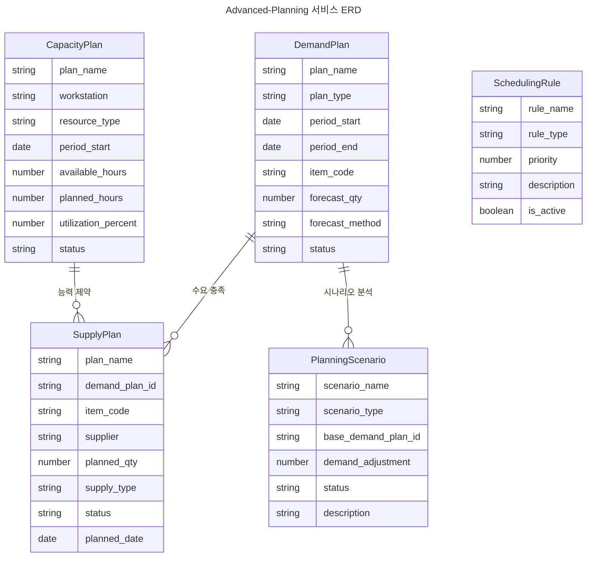

# Advanced-Planning 서비스 ERD

> 자동 생성 — 정합성 검증 프로젝트

```mermaid
---
title: Advanced-Planning 서비스 ERD
---
erDiagram
    DemandPlan {
        string plan_name
        string plan_type
        date period_start
        date period_end
        string item_code
        number forecast_qty
        string forecast_method
        string status
    }

    SupplyPlan {
        string plan_name
        string demand_plan_id
        string item_code
        string supplier
        number planned_qty
        string supply_type
        string status
        date planned_date
    }

    CapacityPlan {
        string plan_name
        string workstation
        string resource_type
        date period_start
        number available_hours
        number planned_hours
        number utilization_percent
        string status
    }

    SchedulingRule {
        string rule_name
        string rule_type
        number priority
        string description
        boolean is_active
    }

    PlanningScenario {
        string scenario_name
        string scenario_type
        string base_demand_plan_id
        number demand_adjustment
        string status
        string description
    }

    DemandPlan ||--o{ SupplyPlan : "수요 충족"
    DemandPlan ||--o{ PlanningScenario : "시나리오 분석"
    CapacityPlan ||--o{ SupplyPlan : "능력 제약"
```
