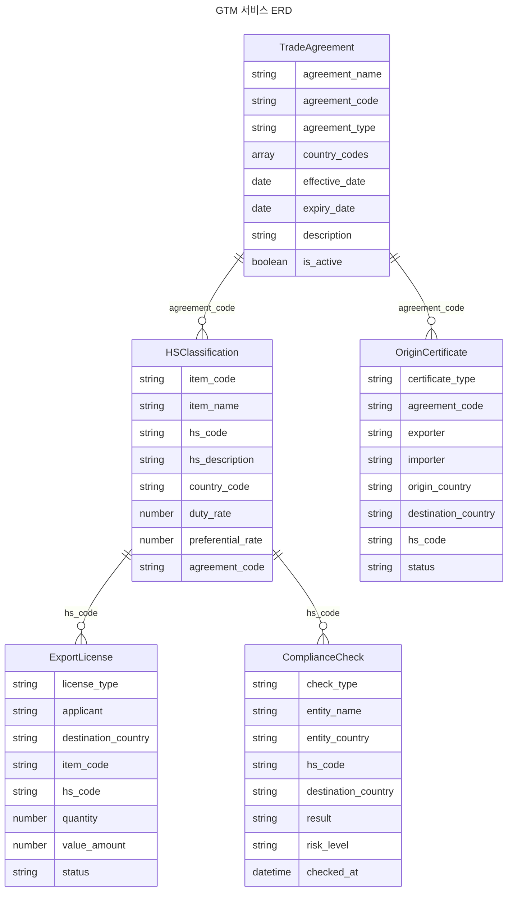

# GTM 서비스 ERD

> 자동 생성 — 정합성 검증 프로젝트

```mermaid
---
title: GTM 서비스 ERD
---
erDiagram
    TradeAgreement {
        string agreement_name
        string agreement_code
        string agreement_type
        array country_codes
        date effective_date
        date expiry_date
        string description
        boolean is_active
    }

    HSClassification {
        string item_code
        string item_name
        string hs_code
        string hs_description
        string country_code
        number duty_rate
        number preferential_rate
        string agreement_code
    }

    OriginCertificate {
        string certificate_type
        string agreement_code
        string exporter
        string importer
        string origin_country
        string destination_country
        string hs_code
        string status
    }

    ExportLicense {
        string license_type
        string applicant
        string destination_country
        string item_code
        string hs_code
        number quantity
        number value_amount
        string status
    }

    ComplianceCheck {
        string check_type
        string entity_name
        string entity_country
        string hs_code
        string destination_country
        string result
        string risk_level
        datetime checked_at
    }

    TradeAgreement ||--o{ HSClassification : "agreement_code"
    TradeAgreement ||--o{ OriginCertificate : "agreement_code"
    HSClassification ||--o{ ExportLicense : "hs_code"
    HSClassification ||--o{ ComplianceCheck : "hs_code"
```
