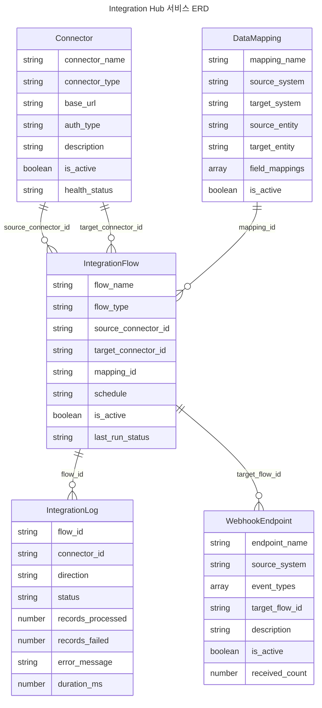

# Integration Hub 서비스 ERD

> 자동 생성 — 정합성 검증 프로젝트

```mermaid
---
title: Integration Hub 서비스 ERD
---
erDiagram
    Connector {
        string connector_name
        string connector_type
        string base_url
        string auth_type
        string description
        boolean is_active
        string health_status
    }

    IntegrationFlow {
        string flow_name
        string flow_type
        string source_connector_id
        string target_connector_id
        string mapping_id
        string schedule
        boolean is_active
        string last_run_status
    }

    DataMapping {
        string mapping_name
        string source_system
        string target_system
        string source_entity
        string target_entity
        array field_mappings
        boolean is_active
    }

    WebhookEndpoint {
        string endpoint_name
        string source_system
        array event_types
        string target_flow_id
        string description
        boolean is_active
        number received_count
    }

    IntegrationLog {
        string flow_id
        string connector_id
        string direction
        string status
        number records_processed
        number records_failed
        string error_message
        number duration_ms
    }

    Connector ||--o{ IntegrationFlow : "source_connector_id"
    Connector ||--o{ IntegrationFlow : "target_connector_id"
    DataMapping ||--o{ IntegrationFlow : "mapping_id"
    IntegrationFlow ||--o{ IntegrationLog : "flow_id"
    IntegrationFlow ||--o{ WebhookEndpoint : "target_flow_id"
```
