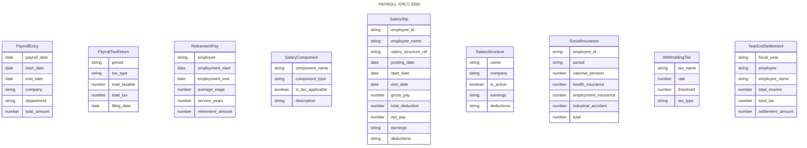

# PAYROLL 서비스 ERD

> 자동 생성 — `scripts/docs/gen_erd.py`

```mermaid
---
title: PAYROLL 서비스 ERD
---
erDiagram
    PayrollEntry {
        date payroll_date
        date start_date
        date end_date
        string company
        string department
        number total_amount
    }
    PayrollTaxReturn {
        string period
        string tax_type
        number total_taxable
        number total_tax
        date filing_date
    }
    RetirementPay {
        string employee
        date employment_start
        date employment_end
        number average_wage
        number service_years
        number retirement_amount
    }
    SalaryComponent {
        string component_name
        string component_type
        boolean is_tax_applicable
        string description
    }
    SalarySlip {
        string employee_id
        string employee_name
        string salary_structure_ref
        date posting_date
        date start_date
        date end_date
        number gross_pay
        number total_deduction
        number net_pay
        string earnings
        string deductions
    }
    SalaryStructure {
        string name
        string company
        boolean is_active
        string earnings
        string deductions
    }
    SocialInsurance {
        string employee_id
        string period
        number national_pension
        number health_insurance
        number employment_insurance
        number industrial_accident
        number total
    }
    WithholdingTax {
        string tax_name
        number rate
        number threshold
        string tax_type
    }
    YearEndSettlement {
        string fiscal_year
        string employee
        string employee_name
        number total_income
        number total_tax
        number settlement_amount
    }
```
