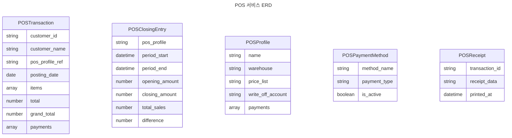

# POS 서비스 ERD

> 자동 생성 — 정합성 검증 프로젝트 (selling 서비스 POS 관련 모델 기반)

```mermaid
---
title: POS 서비스 ERD
---
erDiagram
    POSTransaction {
        string customer_id
        string customer_name
        string pos_profile_ref
        date posting_date
        array items
        number total
        number grand_total
        array payments
    }
    POSClosingEntry {
        string pos_profile
        datetime period_start
        datetime period_end
        number opening_amount
        number closing_amount
        number total_sales
        number difference
    }
    POSProfile {
        string name
        string warehouse
        string price_list
        string write_off_account
        array payments
    }
    POSPaymentMethod {
        string method_name
        string payment_type
        boolean is_active
    }
    POSReceipt {
        string transaction_id
        string receipt_data
        datetime printed_at
    }
```
