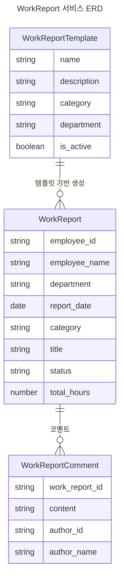

# WorkReport 서비스 ERD

> 자동 생성 — 정합성 검증 프로젝트

```mermaid
---
title: WorkReport 서비스 ERD
---
erDiagram
    WorkReport {
        string employee_id
        string employee_name
        string department
        date report_date
        string category
        string title
        string status
        number total_hours
    }

    WorkReportComment {
        string work_report_id
        string content
        string author_id
        string author_name
    }

    WorkReportTemplate {
        string name
        string description
        string category
        string department
        boolean is_active
    }

    WorkReport ||--o{ WorkReportComment : "코멘트"
    WorkReportTemplate ||--o{ WorkReport : "템플릿 기반 생성"
```
