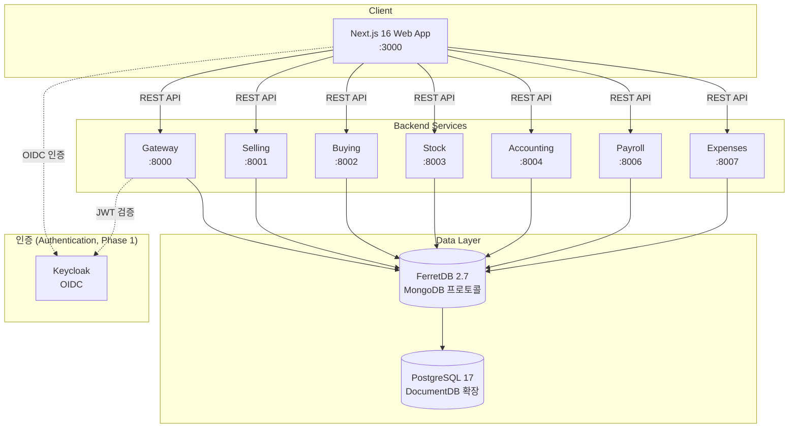

# 아키텍처 개요 (Architecture Overview)

OneERP의 전체 시스템 구조 (system architecture), 서비스 경계 (service boundaries), 데이터 흐름 (data flow)을 설명한다.

---

## 시스템 구조도 (System Architecture Diagram)



---

## 기술 스택 (Technology Stack)

| 영역 (Area) | 기술 (Technology) | 버전 (Version) |
|------|------|------|
| BE 프레임워크 (Framework) | FastAPI + Pydantic v2 | fastapi >= 0.115, pydantic >= 2.11 |
| BE 린트/포맷 (Lint/Format) | ruff | 0.15.0 |
| BE 타입체크 (Type Check) | ty | 0.0.15 |
| BE 패키지 관리 (Package Manager) | uv workspace | 0.11.x |
| FE 프레임워크 (Framework) | Next.js 16 (App Router, Turbopack) | ^16.0.0 |
| FE 스타일 (Styling) | Tailwind CSS 4 (CSS-first) | ^4.1.0 |
| FE 린트/포맷 (Lint/Format) | Biome | ^2.0.0 |
| FE 패키지 관리 (Package Manager) | pnpm workspace | 10.x |
| DB | FerretDB (MongoDB 프로토콜, PostgreSQL 백엔드) | 2.7.0 |
| Python | 3.14 | 3.14.x |
| Node.js | 22 | 22.x |
| 인증 (Authentication) | Keycloak OIDC (Phase 1) | - |
| CI | CI Actions | - |
| 배포 (Deployment) | Flux + Helm (Phase 2) | - |

---

## 서비스 경계 (Service Boundaries — DDD Bounded Context)

각 서비스는 독립된 도메인 경계 (bounded context)를 가지며, 자체 FerretDB 컬렉션 (collection)을 소유한다.

| 서비스 (Service) | 도메인 (Domain) | 핵심 엔티티 (Key Entities) |
|--------|--------|------------|
| **Gateway** | CRM, HR, Assets, Projects, Quality, Setup, 전자결재 (Approval) | Lead, Opportunity, Employee, Department, Asset, Project, ApprovalRequest, Company, User, Role |
| **Selling** | 판매 (Sales), POS | Customer, Quotation, SalesOrder, SalesInvoice, DeliveryNote, POSProfile, POSTransaction |
| **Buying** | 구매 (Purchasing) | Supplier, PurchaseOrder, PurchaseInvoice, MaterialRequest, PurchaseReceipt, SupplierQuotation |
| **Stock** | 재고 (Inventory), 생산 (Manufacturing) | Item, Warehouse, StockEntry, BOM, WorkOrder, Batch, SerialNo, ProductionPlan |
| **Accounting** | 회계 (Accounting), 세무 (Tax) | Account, JournalEntry, CostCenter, Budget, FiscalYear, VATReturn, ETaxInvoice |
| **Payroll** | 급여 (Payroll) | SalaryStructure, SalarySlip, PayrollEntry, SocialInsurance, WithholdingTax |
| **Expenses** | 경비 (Expenses) | ExpenseClaim, ExpenseType, CorporateCard, TravelRequest |

> **Gateway**에 CRM/HR/Assets/Projects/Quality/Setup이 집중되어 있다.
> Phase 3에서 HR, Assets 등을 별도 서비스로 분리 예정 (planned for Phase 3).

---

## 공통 패키지 (Common Kernel — oneerp_core)

모든 서비스가 의존하는 공통 커널 (shared kernel)이다. 현재는 `core/oneerp_core/`에 위치한다.

| 모듈 (Module) | 역할 (Role) |
|------|------|
| `app_factory` | FastAPI 앱 팩토리 (App Factory) --- 미들웨어, 예외 핸들러, 헬스체크 자동 등록 |
| `config` | `CoreSettings` --- `ONEERP_` 접두사 환경변수 기반 설정 (`pydantic-settings`) |
| `db` | FerretDB(MongoDB) 연결 관리 (Connection Manager) --- `MongoClient` 싱글턴 (Singleton) |
| `document` | `BaseDocument` --- 모든 비즈니스 엔티티의 기반 모델 (Base Model: tenant_id, docstatus, timestamps) |
| `repository` | `Repository` --- 제네릭 CRUD 추상화 (Generic CRUD Abstraction), tenant_id 자동 격리 (Auto Isolation) |
| `naming` | 넘버링 시리즈 (Naming Series) --- `{PREFIX}-{YYYY}-{#####}` 패턴 자동 채번 (Auto Numbering) |
| `auth` | OIDC 인증 스텁 (Auth Stub) --- Phase 0에서 더미 사용자 (Dummy User), Phase 1에서 Keycloak 연동 |
| `tenant` | 멀티테넌시 (Multi-tenancy) --- `X-Tenant-Id` 헤더에서 tenant_id 추출 |
| `middleware` | `RequestIdMiddleware` --- 요청별 고유 ID 부여 (Unique Request ID via `X-Request-Id`) |
| `errors` | `OneERPError` + 표준 에러 응답 핸들러 (Standard Error Response Handler) |
| `audit` | 감사 로그 (Audit Log) --- `audit_events` 컬렉션에 이벤트 저장 |
| `logging` | 구조화 JSON 로깅 (Structured JSON Logging) --- 서비스명, request_id, tenant_id 자동 포함 |
| `health` | K8s probe 3종 --- `/health`, `/health/live`, `/health/ready`, `/health/startup` |
| `models` | `TimestampMixin`, `TenantScopedMixin` --- Pydantic 믹스인 (Mixins) |

---

## 데이터 흐름 (Data Flow)

### 문서 라이프사이클 (Document Lifecycle)

모든 비즈니스 문서는 ERPNext 호환 DocStatus를 따른다:

```
DRAFT (0) ─── submit ──→ SUBMITTED (1) ─── cancel ──→ CANCELLED (2)
     │
     └──── delete (초안만 삭제 가능 / only drafts can be deleted)
```

### CRUD 요청 흐름 (CRUD Request Flow)

```
클라이언트 (Client) → FastAPI 라우터 (Router) → Repository → FerretDB 컬렉션 (Collection)
                  │
                  ├── generate_name(): 자동 채번 (Auto Numbering on INSERT)
                  ├── _with_tenant(): tenant_id 자동 필터링 (Auto Tenant Filtering)
                  └── _coerce_dates(): date → datetime 변환 (Date Coercion)
```

### ID 채번 규칙 (ID Naming Rules)

`naming.generate_name(prefix)` 함수가 FerretDB의 `findAndModify`로 원자적 카운터 (atomic counter)를 증가시킨다.

```
패턴 (Pattern): {prefix}-{YYYY}-{#####}
예시 (Examples): SO-2026-00001, CUST-2026-00042, JE-2026-00003
```

---

## 인증/인가 (Authentication / Authorization — ADR-0006)

### 3-Tier 권한 모델 (3-Tier Permission Model)

SaaS 멀티테넌트 (multi-tenant) 환경에서 세 단계의 사용자 등급으로 접근을 제어한다:

| Tier | 설명 (Description) | 권한 범위 (Permission Scope) |
|------|------|----------|
| **Super Admin** | SaaS 운영자 (SaaS Operator) | 크로스테넌트 접근 (Cross-tenant Access), 모든 기능, 관리 대시보드 |
| **Tenant Admin** | 테넌트 관리자 (Tenant Administrator) | 소속 테넌트 내 모든 기능 (All Functions within Tenant), 사용자/역할 관리 |
| **Regular** | 일반 사용자 (Regular User) | 할당된 역할/권한 (Assigned Roles/Permissions: `{resource}:{action}`) 범위 내 접근 |

### JWT 3단계 인증 (3-Step JWT Authentication)

```
1단계 (Step 1): JWT 쿠키(token) 또는 Authorization: Bearer 토큰 검증 (Token Validation)
2단계 (Step 2): X-Tenant-Id / X-User-Sub 헤더 폴백 (Header Fallback for Dev/Test)
3단계 (Step 3): ONEERP_DEBUG=true → 더미 Super Admin 사용자 (Dummy Super Admin for Phase 0)
```

JWT payload에 `sub`, `tenant_id`, `roles`, `permissions`, `user_tier`, `is_super_admin`을 포함한다.

### FE 3-Layer Defense (Frontend 3-Layer Defense)

프론트엔드 권한 검증 (permission verification)은 3중 계층으로 적용된다:

1. **Next.js Middleware** (`middleware.ts`): 인증 쿠키 검증 (Auth Cookie Validation), 비인증 사용자 로그인 리다이렉트
2. **API Proxy** (`proxy.ts`): JWT 토큰 자동 주입 (Auto JWT Injection), 401 응답 시 리다이렉트
3. **BE 최종 검증 (Backend Final Validation)**: `require_permission()` 데코레이터로 라우트별 권한 강제 (유일하게 신뢰 가능한 계층 / the only trusted layer)

### Phase 1 (예정 / Planned)

Keycloak OIDC와 연동하여 JWT 발급을 위임한다. BE 검증 로직은 동일하게 유지된다.
JWT issuance will be delegated to Keycloak OIDC. Backend validation logic remains unchanged.

---

## SaaS 테넌트 관리 (SaaS Tenant Management)

### 구독 플랜별 모듈 제한 (Module Restrictions by Subscription Plan)

테넌트 구독 플랜 (subscription plan)에 따라 접근 가능한 서비스/모듈이 달라진다:

| 플랜 (Plan) | 허용 모듈 (Allowed Modules) |
|------|----------|
| Starter | selling, buying, stock, accounting |
| Business | Starter + hr, payroll, expenses |
| Enterprise | 전체 모듈 (All modules) |

### Super Admin 대시보드 (Super Admin Dashboard)

SaaS 운영자가 `/admin/*` 경로에서 다음을 관리한다:

- 테넌트 목록 / 생성 / 플랜 변경 (Tenant List / Create / Plan Change)
- 사용자 목록 / 역할 할당 (User List / Role Assignment)
- 시스템 설정 / 모듈 활성화 (System Settings / Module Activation)
- 권한 매트릭스 조회 (Permission Matrix View)

---

## 멀티테넌시 (Multi-tenancy)

멀티테넌시 격리는 ADR-0005의 3단 등급(Tier 1 Shared / Tier 2 Schema / Tier 3 Dedicated)을 따른다. 기본 Tier 1은 단일 DB 공유 + `tenant_id` 필드 격리다.

- 모든 컬렉션에 `tenant_id` 필드가 존재 (All collections have a `tenant_id` field)
- `Repository._with_tenant()`가 모든 쿼리에 tenant_id 조건을 자동 삽입 (Auto-injects tenant_id filter)
- 개발자가 직접 tenant_id를 필터링할 필요 없음 (Developers don't need to filter manually)
- 테넌트 식별 (Tenant Identification): JWT claims의 `tenant_id` 또는 `X-Tenant-Id` 헤더 폴백
- Super Admin은 `TenantMiddleware`에서 크로스테넌트 접근 (cross-tenant access)이 허용됨

---

## 모노레포 디렉토리 구조 (Monorepo Directory Structure)

```
OneERP/
├── apps/
│   └── web/                         # Next.js 16 프론트엔드 (Frontend)
│       ├── app/                     # App Router 페이지 (Pages)
│       │   ├── (selling)/           # 판매 모듈 라우트 그룹 (Sales Module Route Group)
│       │   ├── (buying)/            # 구매 모듈 라우트 그룹 (Purchasing Module Route Group)
│       │   ├── (stock)/             # 재고 모듈 라우트 그룹 (Inventory Module Route Group)
│       │   ├── (accounting)/        # 회계 모듈 라우트 그룹 (Accounting Module Route Group)
│       │   ├── (hr)/                # HR 모듈 라우트 그룹 (HR Module Route Group)
│       │   ├── (crm)/               # CRM 모듈 라우트 그룹 (CRM Module Route Group)
│       │   └── (settings)/          # 설정 모듈 라우트 그룹 (Settings Module Route Group)
│       ├── components/
│       │   ├── crud/                # 제네릭 CRUD 컴포넌트 (Generic CRUD Components)
│       │   ├── form/                # 폼 컴포넌트 (Form Components)
│       │   ├── layout/              # 레이아웃 패턴 (Layout Patterns: AppShell, Sidebar)
│       │   ├── dashboard/           # 대시보드 패턴 (Dashboard Patterns)
│       │   ├── approval/            # 승인 패턴 (Approval Patterns)
│       │   └── ui/                  # 기본 UI primitive (Button, Input, Badge)
│       └── lib/
│           ├── crud/                # CRUD 타입 시스템 (CRUD Type System: EntityConfig)
│           ├── modules/             # 모듈별 EntityConfig 정의 (Per-module EntityConfig)
│           ├── hooks/               # 커스텀 React 훅 (Custom React Hooks)
│           ├── providers/           # Context Provider
│           └── text-layout/         # 목표 구조: Pretext 기반 텍스트 측정 계층 (Target-state Text Metrics)
│
├── packages/
│   └── core/                        # oneerp_core 공통 커널 (Common Kernel)
│       └── oneerp_core/
│           ├── app_factory.py       # FastAPI 앱 팩토리 (App Factory)
│           ├── config.py            # 공통 설정 (Common Settings)
│           ├── db.py                # FerretDB 연결 (FerretDB Connection)
│           ├── document.py          # BaseDocument 기반 모델 (Base Document Model)
│           ├── repository.py        # 제네릭 Repository (Generic Repository)
│           ├── naming.py            # 넘버링 시리즈 (Naming Series)
│           ├── auth.py              # 인증 스텁 (Auth Stub)
│           └── ...
│
├── services/                        # BE 마이크로서비스 (Backend Microservices)
│   ├── gateway/                     # CRM, HR, Assets, Projects, Quality, Setup
│   ├── selling/                     # 판매 (Sales), POS
│   ├── buying/                      # 구매 (Purchasing)
│   ├── stock/                       # 재고 (Inventory), 생산 (Manufacturing)
│   ├── accounting/                  # 회계 (Accounting), 세무 (Tax)
│   ├── payroll/                     # 급여 (Payroll)
│   └── expenses/                    # 경비 (Expenses)
│       ├── app/
│       │   ├── main.py              # FastAPI 앱 엔트리포인트 (App Entrypoint)
│       │   ├── config.py            # 서비스별 설정 (Service-specific Settings)
│       │   ├── deps.py              # 의존성 주입 (Dependency Injection)
│       │   ├── models/              # Pydantic 모델 (Pydantic Models)
│       │   └── routes/              # API 라우터 (API Routers)
│       └── tests/
│           └── unit/                # 단위 테스트 (Unit Tests)
│
├── docs/                            # 문서 (Documentation)
│   ├── governance/adr/              # Architecture Decision Records
│   ├── onboarding/                  # 온보딩 문서 (Onboarding Docs)
│   └── product/scope/               # 제품 범위 정의 (Product Scope)
│
├── scripts/ci/                      # CI 스크립트 (CI Scripts)
├── tests/e2e/                       # E2E 테스트 (E2E Tests)
├── docker-compose.yml               # FerretDB + PostgreSQL 로컬 개발 (Local Dev)
├── pyproject.toml                   # uv workspace 루트 (uv workspace root)
└── pnpm-workspace.yaml              # pnpm workspace 루트 (pnpm workspace root)
```

---

## ADR 목록 (ADR List — Architecture Decision Records)

프로젝트의 주요 기술 결정은 `docs/governance/adr/`에 기록되어 있다.
Major technical decisions are recorded in `docs/governance/adr/`.

> 2026-04-13 이전 ADR(0004/0006/0007/0010/0011/0014)은 모두 폐기되고
> "상용 제품 수준 격상" 최우선 과제 하에 ADR-0001~0012로 전면 재작성됐다.

| ADR | 제목 (Title) |
|-----|------|
| [0001](../governance/adr/0001-commercial-grade-definition.md) | 상용 제품 정의(DoD) + 23개 통과 게이트 |
| [0002](../governance/adr/0002-commercialization-waves.md) | 상용화 웨이브 분류 방법론 (4축 100점) |
| [0003](../governance/adr/0003-test-strategy-and-coverage-gates.md) | 4계층 테스트 + 라벨별 커버리지 게이트 |
| [0004](../governance/adr/0004-database-standard-ferretdb.md) | FerretDB 표준 + 사용 화이트리스트 + 출구 트리거 |
| [0005](../governance/adr/0005-multitenancy-isolation-tiers.md) | 멀티테넌시 3단 격리(Shared/Schema/Dedicated) |
| [0006](../governance/adr/0006-authorization-model-rbac-abac.md) | RBAC + ABAC 인가 모델 + 권한 매트릭스 의무 |
| [0007](../governance/adr/0007-api-stability-versioning-contract.md) | API 버전·호환·Deprecation 계약 |
| [0008](../governance/adr/0008-observability-baseline.md) | 관측성 baseline (OTel·Prometheus·JSON 로그·Audit 4축) |
| [0009](../governance/adr/0009-backup-recovery-rpo-rto.md) | 백업·복구 RPO/RTO + 데이터 등급 |
| [0010](../governance/adr/0010-deployment-pipeline-standard.md) | 배포 파이프라인 (buildx + 환경 승격 + 카나리) |
| [0011](../governance/adr/0011-runtime-cluster-decomposition.md) | 코드 조직 — 12 도메인 클러스터 디렉토리 (ADR-0014와 직교) |
| [0012](../governance/adr/0012-commercialization-wave-mapping.md) | 47 모듈 Wave 1~4 매핑 |
| [0014](../governance/adr/0014-runtime-plane-decomposition.md) | 런타임 plane 분해 — 6 plane(api/realtime/worker/scheduler/edge/extension) |

---

## FE 디자인 시스템 구조 (Frontend Design System Structure)

OneERP 프론트엔드는 아래 경로만 허용한다.

`template -> pattern -> primitive -> token`

- Template: 페이지 정보 구조를 고정
- Pattern: ERP 업무 패턴을 재사용 가능한 조합으로 제공
- Primitive: 범용 UI 상호작용 부품
- Token: 시각 언어, density, text metrics contract 제공

관련 문서:

- `docs/engineering/ui/design-system.md`
- `docs/engineering/ui/tokens.md`
- `docs/engineering/ui/components.md`
- `docs/engineering/ui/page-templates.md`
- `docs/engineering/ui/crud-patterns.md`
- `docs/engineering/ui/enforcement.md`

긴 한국어 라벨, 다국어 품목명, 결재 의견, dense table cell을 안정적으로 처리하기 위해 `pretext` 기반 텍스트 측정 계층을 디자인 시스템의 일부로 사용한다.

---

## 설계 원칙 요약 (Design Principles Summary)

1. **테넌트 격리 최우선 (Tenant Isolation First)** --- Repository가 모든 쿼리에 tenant_id를 자동 삽입
2. **NoSQL 컬렉션 완전 분리 (Fully Separate NoSQL Collections)** --- 엔티티별 독립 컬렉션, 조인 없음 (No Joins)
3. **한국 비즈니스 우선 (Korea Business First)** --- K-IFRS, 전자세금계산서 (E-Tax Invoice), 4대보험 (Social Insurance), 연말정산 (Year-end Settlement) 등 한국 고유 모듈 포함
4. **ERPNext 호환 DocStatus** --- 문서 상태 전이 (Document State Transition: Draft/Submitted/Cancelled) 표준화
5. **환경변수 기반 설정 (Environment Variable-based Config)** --- 하드코딩 금지, `ONEERP_` 접두사로 통일
