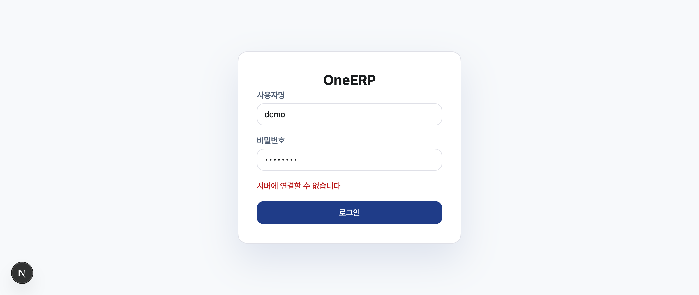
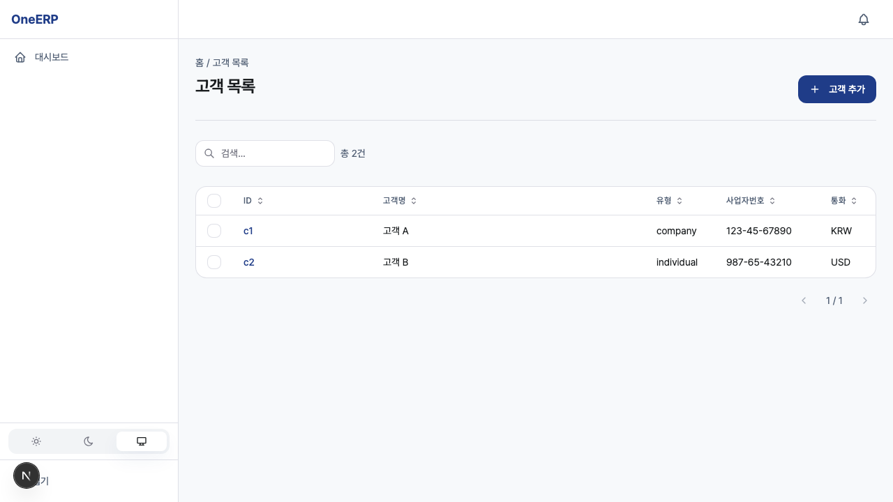
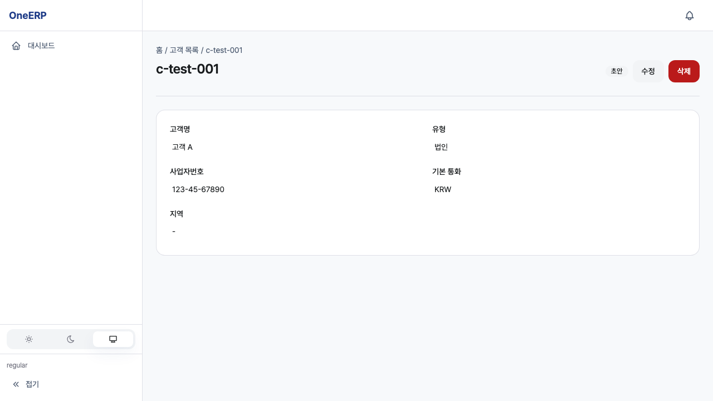
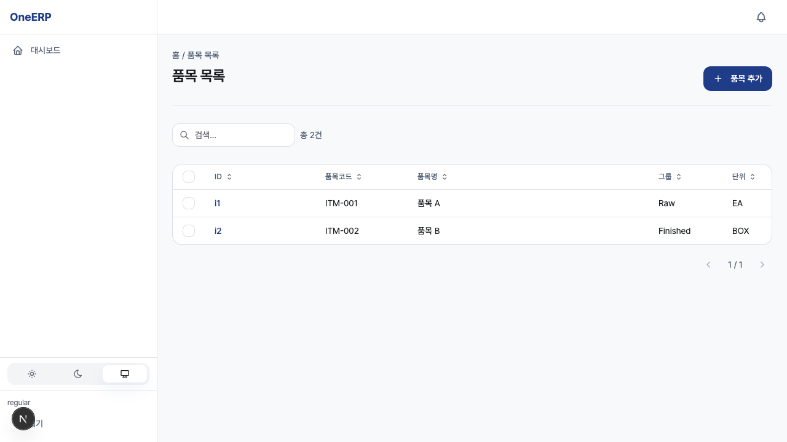
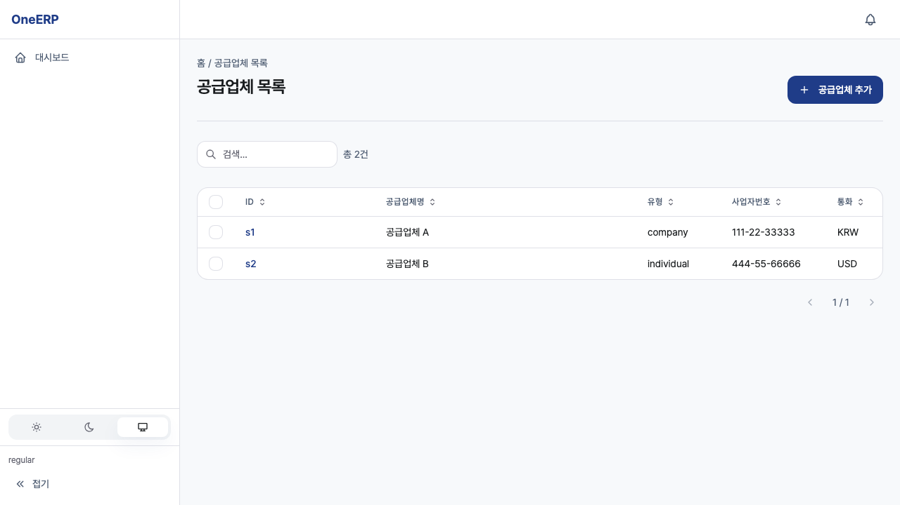

# integration-hub 사용자 매뉴얼

## 개요

`integration-hub` 모듈은 OneERP SaaS 상용 출시 기준의 사용자-facing 업무 단위다.
이 문서는 실제 사용자가 화면에 접속해 업무를 완료하고 결과를 확인하는 흐름을 기준으로 작성한다.
운영 절차는 모듈별 runbook, API 계약은 docs/api 정본, 상용 준비도는 commercial-status를 따른다.
기능 설명은 관리자, 실무자, 검토자가 같은 용어로 대화할 수 있도록 화면명과 결과 중심으로 정리한다.

기존 문서 메모:
> ---
> module: integration-hub
> audience: integration-engineer, admin
> last_updated: 2026-04-22
> ---
> # integration-hub 사용자 매뉴얼
> ## 개요
> 외부 시스템 연계 허브. 커넥터 관리·이벤트 변환·재시도 큐·circuit breaker.
> ERP/CRM/세무/은행/물류 연동을 단일 허브로 집약.
> ## 주요 화면
> - **커넥터 목록** (`/integration-hub/connectors`) — 활성·비활성·오류 상태
> - **메시지 큐** (`/integration-hub/queues`) — 재시도·DLQ·성공 이력
> - **자격 증명** (`/integration-hub/credentials`) — OAuth 토큰·API 키 회전
> - **모니터링** (`/integration-hub/metrics`) — 처리량·지연·실패율
> ## 자주 쓰는 작업
> | 작업 | 경로 |
> |---|---|
> | 신규 커넥터 등록 | 커넥터 → 추가 |
> | 실패 메시지 재시도 | 큐 → 선택 → 재시도 |
> | 자격증명 회전 | 자격 증명 → 회전 |
> ## 관련 문서
> - 런북: `docs/ops/runbook-integration-hub.md`
> - 튜토리얼: `docs/tutorials/integration-hub.md`

시각 증거:

## 시작하기

1. `/login`에서 회사 계정 또는 SSO로 로그인한다.
2. 좌측 탐색 또는 검색에서 `integration-hub` 모듈을 선택한다.
3. 현재 tenant와 회사 컨텍스트가 올바른지 상단 표시를 확인한다.
4. 목록 화면의 필터와 정렬을 초기화한 뒤 대상 데이터를 찾는다.
5. 신규 작업이면 새로 만들기 버튼을 사용하고, 기존 작업이면 상세 화면으로 들어간다.
6. 저장 전 필수값, 권한, 첨부 파일, 관련 모듈 상태를 확인한다.
7. 저장 후 toast, 상태 badge, 목록 갱신, 감사 로그 중 최소 두 가지로 결과를 확인한다.

권한 준비:
- 일반 사용자는 조회와 본인 작업 생성 권한을 갖는다.
- 매니저는 승인, 반려, 상태 변경 권한을 갖는다.
- 관리자는 설정, 코드표, 연동 상태, 감사 로그를 확인한다.
- 권한이 부족하면 `/unauthorized` 또는 화면 내 권한 안내가 표시된다.

## 주요 화면

- **integration-hub 목록**: 검색, 필터, 정렬, bulk action, export를 제공한다.
- **integration-hub 상세**: 상태, 연결 문서, 변경 이력, 첨부, comment를 보여준다.
- **integration-hub 신규/수정**: 필수값 검증, 저장 전 preview, 저장 후 redirect를 제공한다.
- **integration-hub 대시보드**: G4-1 dashboard와 연결되는 업무 KPI를 표시한다.
- **integration-hub 설정**: 번호 규칙, 승인 경로, 기본값, 외부 연동 상태를 관리한다.
- **감사 로그**: 생성, 수정, 승인, 삭제, 권한 변경 이벤트를 시간순으로 추적한다.

화면 상태:
- 로딩 중에는 skeleton 또는 진행 상태가 표시된다.
- 데이터가 없으면 다음 행동을 제안하는 empty state가 표시된다.
- 검증 오류는 필드 근처와 요약 영역에 같이 표시된다.
- 서버 오류는 재시도 가능 여부와 incident id를 보여준다.
- 권한 오류는 필요한 역할과 요청 경로를 안내한다.

## 자주 쓰는 작업

| 작업 | 사용자 시나리오 | 기대 결과 |
|------|----------------|-----------|
| 목록 조회 | 사용자가 모듈 목록에 접속하고 필터를 적용한다 | 조건에 맞는 행과 총 건수가 표시된다 |
| 신규 생성 | 사용자가 필수값을 입력하고 저장한다 | 새 레코드가 생성되고 상세 화면으로 이동한다 |
| 수정 | 사용자가 상세에서 수정 화면으로 이동해 값을 바꾼다 | 변경 값과 감사 로그가 저장된다 |
| 승인 | 매니저가 대기 건을 승인한다 | 상태가 승인됨으로 바뀌고 후속 이벤트가 발행된다 |
| 반려 | 매니저가 사유를 입력하고 반려한다 | 요청자에게 사유가 표시된다 |
| 내보내기 | 사용자가 필터 결과를 export한다 | 현재 조건의 CSV 또는 XLSX가 생성된다 |

업무 완료 확인:
- 목록의 최신 행이 저장 결과와 일치한다.
- 상세 화면의 상태 badge가 기대 상태다.
- 연결 모듈의 참조 값이 갱신됐다.
- 감사 로그에 actor, timestamp, diff가 남았다.
- notification 또는 email 발송이 필요한 경우 발송 상태가 기록됐다.

## 설정

`integration-hub` 설정은 운영 정책과 사용자 경험을 동시에 바꿀 수 있으므로 관리자 권한에서만 다룬다.

설정 항목:
- 번호 규칙과 prefix
- 기본 상태와 승인 경로
- 필수 필드와 검증 조건
- 외부 시스템 mapping
- 알림 채널과 수신자
- 보관 기간과 export 제한
- 감사 로그 retention

설정 변경 절차:
1. 변경 사유와 영향 범위를 적는다.
2. staging에서 같은 설정을 먼저 적용한다.
3. 대표 사용자 시나리오를 실행한다.
4. 오류가 없으면 production 변경 창에 반영한다.
5. 변경 뒤 30분간 G4-1 dashboard를 확인한다.

## 제한사항

- 권한이 없는 사용자는 민감 필드와 bulk action을 볼 수 없다.
- 이미 승인된 문서는 일부 필드가 잠긴다.
- 외부 연동 장애 시 저장은 가능하지만 전송 상태가 pending으로 남을 수 있다.
- 대량 export는 tenant 정책과 개인정보 정책에 의해 제한된다.
- 삭제는 기본적으로 soft-delete이며, 법적 보관 대상은 삭제할 수 없다.
- 모바일에서는 일부 대량 작업 대신 상세 확인 흐름을 사용한다.

주의할 상황:
- 중복 저장을 막기 위해 저장 버튼은 요청 중 비활성화된다.
- 연결 모듈이 장애 상태면 참조 검색이 느려질 수 있다.
- batch 처리 결과는 즉시 반영되지 않을 수 있으며 상태 조회가 필요하다.
- 금액, 재고, 인사, 권한 관련 변경은 감사 로그 확인이 필수다.

## 장애 대응

장애가 발생하면 `docs/ops/runbook-integration-hub.md`를 먼저 확인한다.
사용자 화면에서 수집할 정보는 재현 경로, 입력값, tenant, timestamp, request id다.

대응 순서:
1. 동일 사용자의 권한 문제인지 전체 장애인지 분리한다.
2. 브라우저 콘솔 오류와 API 응답 코드를 확인한다.
3. 저장 실패면 입력값 검증 오류와 서버 오류를 구분한다.
4. 목록 조회 실패면 필터 조건을 초기화하고 재시도한다.
5. 외부 연동 실패면 재처리 큐와 dead-letter 상태를 확인한다.
6. 데이터 정합성 문제는 변경 전후 snapshot을 보존한다.
7. 운영자에게 incident id와 재현 단계를 전달한다.

사용자 안내 문구:
- 임시 오류: 잠시 후 다시 시도할 수 있음을 안내한다.
- 권한 오류: 필요한 역할과 승인 요청 경로를 안내한다.
- 데이터 잠금: 승인 상태 또는 마감 상태 때문에 수정할 수 없음을 안내한다.
- 연동 지연: 저장은 완료됐고 외부 전송이 pending임을 안내한다.

## FAQ

### 저장했는데 목록에 바로 보이지 않습니다
필터 조건, 정렬, tenant 컨텍스트를 확인한다. 비동기 처리 대상이면 상태 badge가 갱신될 때까지 기다린다.

### 승인 버튼이 보이지 않습니다
현재 사용자의 역할과 문서 상태를 확인한다. 이미 승인됐거나 반려된 문서는 승인 action이 숨겨질 수 있다.

### export 파일이 비어 있습니다
현재 필터 결과가 없는지 확인한다. 권한 정책 때문에 일부 컬럼이 제외될 수 있다.

### 오류를 운영팀에 전달할 때 무엇이 필요합니까
tenant, 사용자 id, 화면 경로, 실행 시각, request id, 입력값 요약, 기대 결과를 전달한다.

### 모바일에서 화면이 다르게 보입니다
모바일은 동일 업무를 작은 화면에 맞춘 순차 흐름으로 제공한다. 결과와 권한 정책은 데스크톱과 같다.
- integration-hub 매뉴얼 보강 1: 사용자 역할, 입력값, 저장 결과, 오류 처리 기준을 한 줄씩 점검한다.
- integration-hub 매뉴얼 보강 2: 운영 런북과 상용 게이트 경로를 같은 모듈명으로 연결한다.
- integration-hub 매뉴얼 보강 3: 권한 오류, 검증 오류, 서버 오류의 사용자 표시를 분리한다.
- integration-hub 매뉴얼 보강 4: 모바일과 데스크톱에서 같은 업무 결과가 나오는지 확인한다.
- integration-hub 매뉴얼 보강 5: 감사 로그가 필요한 작업은 변경 전후 값을 기록한다.
- integration-hub 매뉴얼 보강 6: 외부 연동 실패 시 사용자에게 재시도 가능한 상태를 남긴다.
- integration-hub 매뉴얼 보강 7: 배치나 비동기 작업은 진행 상태와 실패 재처리 경로를 안내한다.
- integration-hub 매뉴얼 보강 8: 업무 완료 뒤 목록, 상세, 리포트 중 최소 두 경로에서 결과를 확인한다.
- integration-hub 매뉴얼 보강 9: 사용자 역할, 입력값, 저장 결과, 오류 처리 기준을 한 줄씩 점검한다.
- integration-hub 매뉴얼 보강 10: 운영 런북과 상용 게이트 경로를 같은 모듈명으로 연결한다.
- integration-hub 매뉴얼 보강 11: 권한 오류, 검증 오류, 서버 오류의 사용자 표시를 분리한다.
- integration-hub 매뉴얼 보강 12: 모바일과 데스크톱에서 같은 업무 결과가 나오는지 확인한다.
- integration-hub 매뉴얼 보강 13: 감사 로그가 필요한 작업은 변경 전후 값을 기록한다.
- integration-hub 매뉴얼 보강 14: 외부 연동 실패 시 사용자에게 재시도 가능한 상태를 남긴다.
- integration-hub 매뉴얼 보강 15: 배치나 비동기 작업은 진행 상태와 실패 재처리 경로를 안내한다.
- integration-hub 매뉴얼 보강 16: 업무 완료 뒤 목록, 상세, 리포트 중 최소 두 경로에서 결과를 확인한다.
- integration-hub 매뉴얼 보강 17: 사용자 역할, 입력값, 저장 결과, 오류 처리 기준을 한 줄씩 점검한다.
- integration-hub 매뉴얼 보강 18: 운영 런북과 상용 게이트 경로를 같은 모듈명으로 연결한다.
- integration-hub 매뉴얼 보강 19: 권한 오류, 검증 오류, 서버 오류의 사용자 표시를 분리한다.
- integration-hub 매뉴얼 보강 20: 모바일과 데스크톱에서 같은 업무 결과가 나오는지 확인한다.
- integration-hub 매뉴얼 보강 21: 감사 로그가 필요한 작업은 변경 전후 값을 기록한다.
- integration-hub 매뉴얼 보강 22: 외부 연동 실패 시 사용자에게 재시도 가능한 상태를 남긴다.
- integration-hub 매뉴얼 보강 23: 배치나 비동기 작업은 진행 상태와 실패 재처리 경로를 안내한다.
- integration-hub 매뉴얼 보강 24: 업무 완료 뒤 목록, 상세, 리포트 중 최소 두 경로에서 결과를 확인한다.
- integration-hub 매뉴얼 보강 25: 사용자 역할, 입력값, 저장 결과, 오류 처리 기준을 한 줄씩 점검한다.
- integration-hub 매뉴얼 보강 26: 운영 런북과 상용 게이트 경로를 같은 모듈명으로 연결한다.
- integration-hub 매뉴얼 보강 27: 권한 오류, 검증 오류, 서버 오류의 사용자 표시를 분리한다.
- integration-hub 매뉴얼 보강 28: 모바일과 데스크톱에서 같은 업무 결과가 나오는지 확인한다.
- integration-hub 매뉴얼 보강 29: 감사 로그가 필요한 작업은 변경 전후 값을 기록한다.
- integration-hub 매뉴얼 보강 30: 외부 연동 실패 시 사용자에게 재시도 가능한 상태를 남긴다.
- integration-hub 매뉴얼 보강 31: 배치나 비동기 작업은 진행 상태와 실패 재처리 경로를 안내한다.
- integration-hub 매뉴얼 보강 32: 업무 완료 뒤 목록, 상세, 리포트 중 최소 두 경로에서 결과를 확인한다.
- integration-hub 매뉴얼 보강 33: 사용자 역할, 입력값, 저장 결과, 오류 처리 기준을 한 줄씩 점검한다.
- integration-hub 매뉴얼 보강 34: 운영 런북과 상용 게이트 경로를 같은 모듈명으로 연결한다.
- integration-hub 매뉴얼 보강 35: 권한 오류, 검증 오류, 서버 오류의 사용자 표시를 분리한다.
- integration-hub 매뉴얼 보강 36: 모바일과 데스크톱에서 같은 업무 결과가 나오는지 확인한다.
- integration-hub 매뉴얼 보강 37: 감사 로그가 필요한 작업은 변경 전후 값을 기록한다.
- integration-hub 매뉴얼 보강 38: 외부 연동 실패 시 사용자에게 재시도 가능한 상태를 남긴다.
- integration-hub 매뉴얼 보강 39: 배치나 비동기 작업은 진행 상태와 실패 재처리 경로를 안내한다.
- integration-hub 매뉴얼 보강 40: 업무 완료 뒤 목록, 상세, 리포트 중 최소 두 경로에서 결과를 확인한다.
- integration-hub 매뉴얼 보강 41: 사용자 역할, 입력값, 저장 결과, 오류 처리 기준을 한 줄씩 점검한다.
- integration-hub 매뉴얼 보강 42: 운영 런북과 상용 게이트 경로를 같은 모듈명으로 연결한다.
- integration-hub 매뉴얼 보강 43: 권한 오류, 검증 오류, 서버 오류의 사용자 표시를 분리한다.
- integration-hub 매뉴얼 보강 44: 모바일과 데스크톱에서 같은 업무 결과가 나오는지 확인한다.
- integration-hub 매뉴얼 보강 45: 감사 로그가 필요한 작업은 변경 전후 값을 기록한다.
- integration-hub 매뉴얼 보강 46: 외부 연동 실패 시 사용자에게 재시도 가능한 상태를 남긴다.
- integration-hub 매뉴얼 보강 47: 배치나 비동기 작업은 진행 상태와 실패 재처리 경로를 안내한다.
- integration-hub 매뉴얼 보강 48: 업무 완료 뒤 목록, 상세, 리포트 중 최소 두 경로에서 결과를 확인한다.
- integration-hub 매뉴얼 보강 49: 사용자 역할, 입력값, 저장 결과, 오류 처리 기준을 한 줄씩 점검한다.
- integration-hub 매뉴얼 보강 50: 운영 런북과 상용 게이트 경로를 같은 모듈명으로 연결한다.
- integration-hub 매뉴얼 보강 51: 권한 오류, 검증 오류, 서버 오류의 사용자 표시를 분리한다.
- integration-hub 매뉴얼 보강 52: 모바일과 데스크톱에서 같은 업무 결과가 나오는지 확인한다.
- integration-hub 매뉴얼 보강 53: 감사 로그가 필요한 작업은 변경 전후 값을 기록한다.
- integration-hub 매뉴얼 보강 54: 외부 연동 실패 시 사용자에게 재시도 가능한 상태를 남긴다.
- integration-hub 매뉴얼 보강 55: 배치나 비동기 작업은 진행 상태와 실패 재처리 경로를 안내한다.
- integration-hub 매뉴얼 보강 56: 업무 완료 뒤 목록, 상세, 리포트 중 최소 두 경로에서 결과를 확인한다.
- integration-hub 매뉴얼 보강 57: 사용자 역할, 입력값, 저장 결과, 오류 처리 기준을 한 줄씩 점검한다.
- integration-hub 매뉴얼 보강 58: 운영 런북과 상용 게이트 경로를 같은 모듈명으로 연결한다.
- integration-hub 매뉴얼 보강 59: 권한 오류, 검증 오류, 서버 오류의 사용자 표시를 분리한다.
- integration-hub 매뉴얼 보강 60: 모바일과 데스크톱에서 같은 업무 결과가 나오는지 확인한다.
- integration-hub 매뉴얼 보강 61: 감사 로그가 필요한 작업은 변경 전후 값을 기록한다.
- integration-hub 매뉴얼 보강 62: 외부 연동 실패 시 사용자에게 재시도 가능한 상태를 남긴다.
- integration-hub 매뉴얼 보강 63: 배치나 비동기 작업은 진행 상태와 실패 재처리 경로를 안내한다.
- integration-hub 매뉴얼 보강 64: 업무 완료 뒤 목록, 상세, 리포트 중 최소 두 경로에서 결과를 확인한다.
- integration-hub 매뉴얼 보강 65: 사용자 역할, 입력값, 저장 결과, 오류 처리 기준을 한 줄씩 점검한다.
- integration-hub 매뉴얼 보강 66: 운영 런북과 상용 게이트 경로를 같은 모듈명으로 연결한다.
- integration-hub 매뉴얼 보강 67: 권한 오류, 검증 오류, 서버 오류의 사용자 표시를 분리한다.
- integration-hub 매뉴얼 보강 68: 모바일과 데스크톱에서 같은 업무 결과가 나오는지 확인한다.
- integration-hub 매뉴얼 보강 69: 감사 로그가 필요한 작업은 변경 전후 값을 기록한다.
- integration-hub 매뉴얼 보강 70: 외부 연동 실패 시 사용자에게 재시도 가능한 상태를 남긴다.
- integration-hub 매뉴얼 보강 71: 배치나 비동기 작업은 진행 상태와 실패 재처리 경로를 안내한다.
- integration-hub 매뉴얼 보강 72: 업무 완료 뒤 목록, 상세, 리포트 중 최소 두 경로에서 결과를 확인한다.
- integration-hub 매뉴얼 보강 73: 사용자 역할, 입력값, 저장 결과, 오류 처리 기준을 한 줄씩 점검한다.
- integration-hub 매뉴얼 보강 74: 운영 런북과 상용 게이트 경로를 같은 모듈명으로 연결한다.
- integration-hub 매뉴얼 보강 75: 권한 오류, 검증 오류, 서버 오류의 사용자 표시를 분리한다.
- integration-hub 매뉴얼 보강 76: 모바일과 데스크톱에서 같은 업무 결과가 나오는지 확인한다.
- integration-hub 매뉴얼 보강 77: 감사 로그가 필요한 작업은 변경 전후 값을 기록한다.
- integration-hub 매뉴얼 보강 78: 외부 연동 실패 시 사용자에게 재시도 가능한 상태를 남긴다.
- integration-hub 매뉴얼 보강 79: 배치나 비동기 작업은 진행 상태와 실패 재처리 경로를 안내한다.
- integration-hub 매뉴얼 보강 80: 업무 완료 뒤 목록, 상세, 리포트 중 최소 두 경로에서 결과를 확인한다.
- integration-hub 매뉴얼 보강 81: 사용자 역할, 입력값, 저장 결과, 오류 처리 기준을 한 줄씩 점검한다.
- integration-hub 매뉴얼 보강 82: 운영 런북과 상용 게이트 경로를 같은 모듈명으로 연결한다.
- integration-hub 매뉴얼 보강 83: 권한 오류, 검증 오류, 서버 오류의 사용자 표시를 분리한다.
- integration-hub 매뉴얼 보강 84: 모바일과 데스크톱에서 같은 업무 결과가 나오는지 확인한다.
- integration-hub 매뉴얼 보강 85: 감사 로그가 필요한 작업은 변경 전후 값을 기록한다.
- integration-hub 매뉴얼 보강 86: 외부 연동 실패 시 사용자에게 재시도 가능한 상태를 남긴다.
